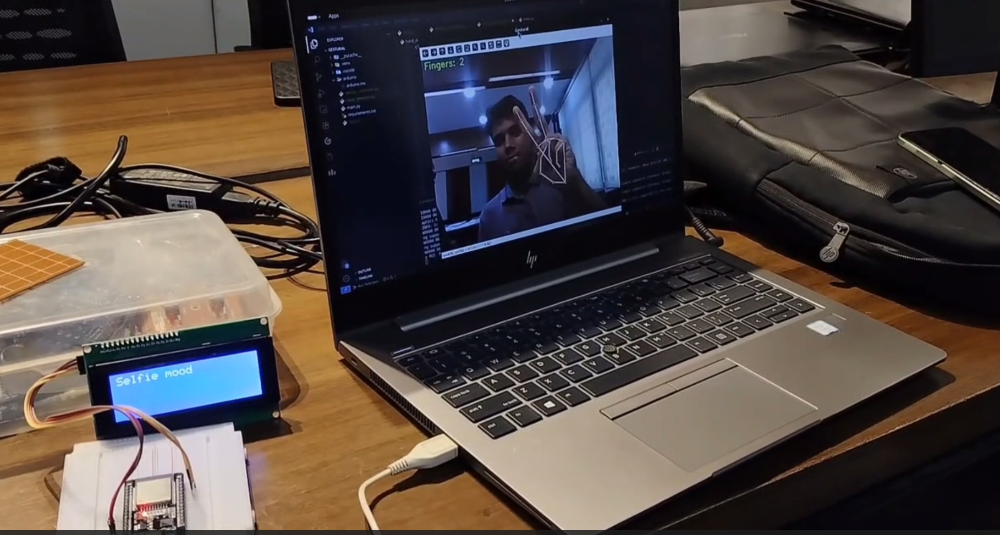

# Gestural ✋🖥️ – Hand Gesture Recognition with LCD Display via PySerial

**Gestural** is a real-time hand gesture recognition system using **OpenCV** and **MediaPipe** that communicates detected gestures to an **LCD monitor** via **PySerial**. It can recognize gestures like:

- 👉 Pointing
- 🖐️ Spread/Open hand
- ✊ Closed fist
- 👍 Thumbs up
- ➕ Easily extensible to custom gestures
-  &nbsp; &nbsp; &nbsp; &nbsp; Selfie mode

This project is perfect for building gesture-controlled interfaces with display feedback.

---

## 🎯 Features

- Real-time gesture recognition using webcam
- Serial communication to Arduino via **PySerial**
- Displays gesture name on **LCD (16x2 or 20x4)**
- Modular and extensible gesture logic

---

## 📸 Demo


<!--  -->

[](https://github.com/saikat709/gestural-lcd/raw/main/demo.mp4)

---

## 🧰 Tech Stack

### Software:
- Python 3
- OpenCV – image processing & camera input
- MediaPipe – hand landmark detection
- PySerial – communicate with Arduino

### Hardware:
- Arduino UNO (or compatible)
- LCD Display (16x2 or 20x4) with I2C module
- USB cable for serial communication

---

## 📦 Installation

### 1. **Istall Python dependencies**

```bash
pip install opencv-python mediapipe pyserial
```

### 2. **Connect LCD to Arduino (via I2C):**
```
    LCD Pin 	Arduino UNO
    GND    	    GND
    VCC    	    5V
    SDA	        A4
    SCL	        A5
```

### 3. **Upload Arduino Sketch**

Use a sketch that:

    Listens over serial (e.g. Serial.readString())

    Prints received gesture text to LCD


### 4. **Run Python Script**

```bash
python gestural.py
```

Your webcam will start. Detected gestures will be printed on the connected LCD.

🧠 How It Works

    OpenCV captures webcam frames.

    MediaPipe identifies hand landmarks.

    Custom gesture logic classifies the pose.

    PySerial sends the gesture as a string to Arduino.

    Arduino reads and displays it on the LCD screen.


## ✍️ Adding New Gestures

Want to add more gestures? Just update the gesture detection logic inside hand_detector.py. Then main.py automatically send that to arduino LCD. Simple and modular.

## 📂 Project Structure


```bash
gestural/
├── gestural.py      # Main Python script
├── demo.png         # Screenshot
├── demo.mp4         # Video demo
├── lcd_arduino.ino  # Arduino sketch for LCD
└── README.md
```


## 👨‍💻 Author

Made with 🧠 + ❤️ by Md. Saikat Islam


### Let me know if you want:
- The actual `gestural.py` or `lcd_arduino.ino` script generated  
- Thumbnail + hosted video included properly  
- Wiring diagram or photo of LCD-setup  


I'll help you polish it like a real pro project 👨‍🔧.
